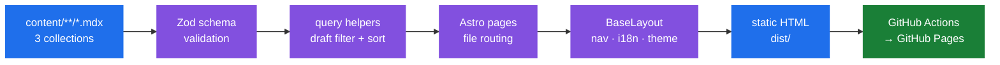

<div align="center">
  <h1>JJ Lab</h1>

  <p><b>A personal lab for technology, engineering practice, and reflective writing.</b></p>
  <p><b>一个记录技术、工程实践与思考的个人实验室。</b></p>

  <p>
    <a href="#overview"><b>English</b></a> · <a href="#中文"><b>中文</b></a>
  </p>

  <p>
    
    
    
    
  </p>
</div>

## Overview

JJ Lab is a content-driven personal website that combines a project portfolio, engineering notes, and long-form writing. It documents work in AI engineering, intelligent hardware, optical sensing, and personal learning.

The site is organized around three content areas:

| Area | Purpose |
|---|---|
| **Projects** | Product, hardware, and research projects with technical context and galleries. |
| **Engineering** | Debugging records, implementation notes, and reproducible technical lessons. |
| **Thinking** | Long-form writing about learning systems, technology, and society. |

## Features

- MDX content collections with Zod schema validation at build time — invalid frontmatter fails the build, not the reader
- Light-first design system with dark mode toggle and Chinese/English interface labels
- Automatic table of contents generated from Markdown heading structure (desktop sidebar + mobile)
- Reading progress bar and Chinese-aware reading time (400 chars/min zh, 200 wpm en)
- Project galleries via frontmatter, with a reusable responsive MDX image component
- GitHub Pages deployment through GitHub Actions

## How It Works



## Quick Start

```bash
npm install
npm run dev      # http://localhost:4321/
npm run build    # validates all MDX frontmatter, outputs dist/
npm run preview  # preview the production build
```

Node ≥ 18.14.1 (Node 22 in the deploy workflow). Live site: <https://ordoabchao7.github.io/personal-blog/>

## Writing Content

All content is MDX in `content/`, validated at build time.

### Add a Thinking Article

Create `content/thinking/YYYY/your-article.mdx`:

```mdx
---
title: Your article title
description: A concise summary of the article.
category: society        # ai-trend | society | startup | tech-analysis
date: '2026-08-20'
tags:
  - learning
featured: false
draft: false
---

## First section
```

Use `##` for sections and `###` for subsections — the table of contents is generated automatically from them; do not write a manual TOC in the body.

### Add a Project

Create `content/projects/your-project.mdx`:

```yaml
---
title: Project name
description: One-line summary.
category: software       # hardware | hardware-ai | software | research
techStack:
  - Python
  - React
status: building         # idea | building | shipped | archived
github: https://github.com/user/repo
gallery:
  - /images/projects/example/cover.jpg
date: '2026-08-20'
---
```

For inline images, use the reusable component (see [`docs/image-management.md`](./docs/image-management.md) for naming and optimization conventions):

```mdx
import BlogImage from '@/components/BlogImage.astro';

<BlogImage
  src="/images/projects/example/cover.jpg"
  alt="A concise description of the image"
  caption="Optional image caption."
/>
```

## Project Structure

```text
├── content/                  # MDX content
│   ├── projects/             #   project case studies
│   ├── engineering/YYYY/     #   engineering notes by year
│   └── thinking/YYYY/        #   long-form writing by year
├── src/
│   ├── components/           # Astro components
│   ├── content/config.ts     # Zod collection schemas
│   ├── layouts/              # Base layout, nav, footer
│   ├── lib/                  # content, i18n, URL, reading helpers
│   ├── pages/                # routes
│   └── styles/               # design tokens + global styles
├── public/images/            # image library
└── .github/workflows/deploy.yml
```

## Deployment

Pushes to `main` trigger `.github/workflows/deploy.yml`: `npm ci` → `npm run build` → upload `dist/` → deploy to GitHub Pages (served under `/personal-blog/`).

<!-- portfolio-authenticity:start -->
## Project status

**Stage:** Personal technical notebook.

**Why I built it:** I built this site to keep project notes, engineering decisions, and learning reflections in a format that is easier to revisit than scattered repository notes.

**Boundary:** The blog is a static personal publication, not a continuously updated knowledge base. Articles can become stale, project descriptions are curated summaries, and external links or screenshots may change over time.

See [PROJECT_STATUS.md](./PROJECT_STATUS.md) for the evidence still needed and the maintenance rule.
<!-- portfolio-authenticity:end -->

## License

This repository is a personal website and portfolio. Review the repository files and included asset licenses before reusing its content.

## 中文

### 简介

JJ Lab 是一个内容驱动的个人网站，包含项目作品集、工程笔记与长文写作三个板块，记录 AI 工程、智能硬件、光学传感与个人学习相关的工作。

### 技术栈

Astro 5 + MDX 内容集合（Zod 构建时校验）+ 原生 CSS 设计令牌 + TypeScript strict。浅色优先设计，支持暗色模式与中英文界面切换；自动生成文章目录、阅读进度条与中文友好的阅读时长统计；通过 GitHub Actions 部署到 GitHub Pages。

### 写作流程

1. 在 `content/thinking/YYYY/`（或 `engineering/`、`projects/`）新建 `.mdx` 文件，frontmatter 构建时自动校验
2. 用 `##` / `###` 组织章节，目录自动生成
3. 图片放 `public/images/`，用 `BlogImage` 组件内嵌
4. `npm run build` 验证后推送到 `main` 即自动部署

完整 frontmatter 字段与示例见上方英文部分。
